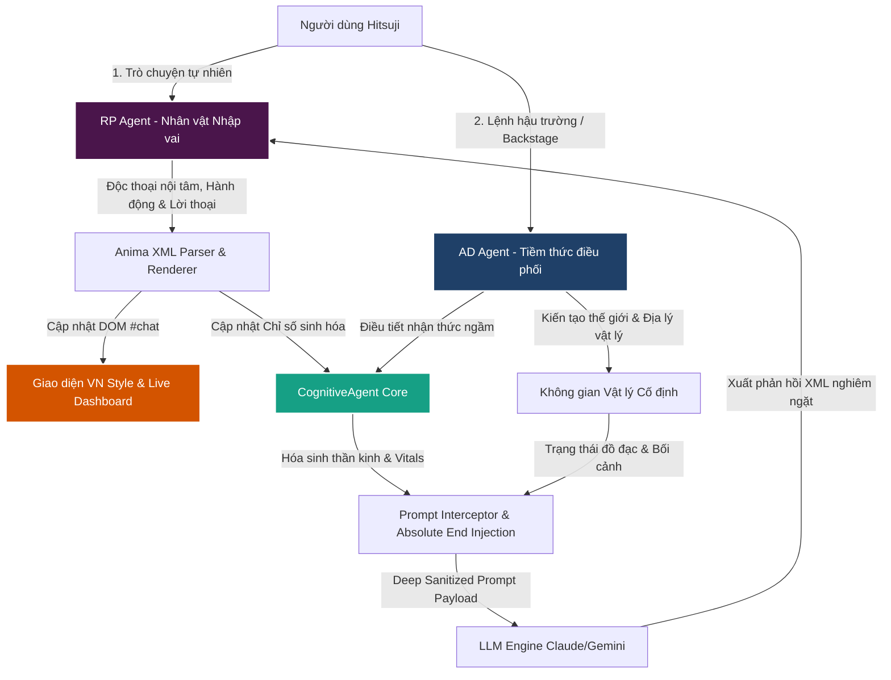

# 🧠 HỆ THỐNG NHẬN THỨC SINH LÝ THẦN KINH TOÀN DIỆN: ANIMA ENGINE (v10.0.0)

> [!TIP]
> **💡 Mẹo Đọc & Góp Ý Siêu Tiện:**
> * **Để xem giao diện hiển thị tuyệt đẹp (nét vẽ, công thức toán):** Nếu đang dùng VS Code, hãy nhấn tổ hợp phím **`Ctrl + Shift + V`** để mở bản xem trước (Markdown Preview) cực kỳ dễ nhìn!
> * **Để lại góp ý của bạn:** Tôi đã tạo sẵn các ô `💬 Góp ý & Nhận xét của Hitsuji` dưới mỗi mục. Bạn chỉ cần điền trực tiếp ý kiến của mình vào đó để lưu giữ và chỉnh sửa bất cứ lúc nào trước khi nghỉ ngơi nhé!

---

## 🗺️ Sơ Đồ Kiến Trúc Hoạt Động (Detailed System Workflow)

### 📊 Bản Text Đơn Giản (Dễ đọc trực tiếp):
1. **Người dùng (Hitsuji)** -> (Nhắn tin tự nhiên) -> **RP Agent** (Nhân vật nhập vai)
2. **Người dùng (Hitsuji)** -> (Lệnh sau cánh gà) -> **AD Agent** (Tiềm thức điều phối chỉ số & môi trường)
3. **RP Agent** -> (Tự động xuất XML) -> **Parser & Renderer** -> Tách biệt Độc thoại, Hành động & Lời thoại -> Render giao diện Visual Novel động và cập nhật chỉ số vào **Cognitive Core**.
4. **Cognitive Core** -> (Tính toán động lực học sinh lý & Vitals) -> **Prompt Interceptor** -> Sanitize và tiêm cưỡng bức XML vào cuối Prompt -> Gửi lên API LLM.

### 🎨 Sơ đồ Hệ Thống (Xem bằng Markdown Preview - `Ctrl+Shift+V`):


> 💬 **Góp ý & Nhận xét của Hitsuji về workflow:**
> * *(Gõ góp ý hoặc thay đổi bạn muốn thực hiện ở đây)*

---

## 🧪 5 Trụ Cột Nhận Thức Lõi & Cơ Sở Khoa Học (The 5 Core Pillars & Theoretical Foundations)

---

### 1. Hệ Thống Phản Ứng (Reaction System - Neuro-Chemical Axis)

Thay vì tăng giảm các chỉ số tâm lý một cách tuyến tính thô sơ ($x = x + \text{value}$), hệ thống tái mô phỏng **8 chất dẫn truyền thần kinh và nội tiết tố** cốt lõi của não bộ và cơ thể người dựa trên các mô hình dược động học lâm sàng thực tế:

#### 🧪 Bản đồ Sinh hóa Thần kinh Động (The Neurochemical Map)
* **Adrenaline (Stress cấp tính):** Làm nhịp tim vọt tăng, câu thoại ngắn đi, tăng tính cảnh giác, hành động dồn dập.
* **Cortisol (Stress mãn tính):** Triệt tiêu serotonin, làm nhân vật u uất, suy kiệt, đau lòng dai dẳng thể hiện qua suy nghĩ `<thought>`.
* **Melatonin (Ngủ/Thức):** Tích tụ khi mệt mỏi, đạt $\ge 8.0$ ép nhân vật ngủ ngầm hoặc uể oải sâu.
* **Dopamine (Động lực):** Thúc đẩy đối thoại hướng ngoại, tăng tính tò mò, kiêu hãnh và ham thích thách thức.
* **Serotonin (Yên bình):** Ổn định tâm trạng, kháng stress, làm dịu adrenaline.
* **Oxytocin (Gắn kết):** Tăng khi được ôm ấp/chải tóc (`#intimate`); làm giảm cortisol cấp tốc.
* **Endorphins (Giảm đau tự nhiên):** Tăng khi ăn uống/bôi cao xoa bóp; triệt tiêu cơn đau cấp và mãn tính.
* **Sex Hormones (Xung năng):** Tăng tính chiếm hữu, sự kiêu hãnh và drive sinh học trong kịch bản.

#### 📈 Râu Ria Lý Thuyết & Minh Chứng Nghiên Cứu:
1. **Phương Trình Phân Rã Dược Động Học Bậc Một (First-Order Exponential Decay):**
   Mọi hormone trong cơ thể đều phân rã tự nhiên theo thời gian thực chạy ngầm và thời gian kể chuyện ($T_{\text{elapsed}}$):
   $$C(t) = C_b + (C_0 - C_b) \cdot e^{-k \cdot t}$$
   Trong đó $C_b$ là nồng độ baseline cơ sở, $C_0$ là nồng độ ban đầu sau kích thích, và $k$ là hằng số phân rã được tính từ chu kỳ bán thải y khoa ($k = \ln(2)/t_{1/2}$).
   *(Ví dụ: Adrenaline bán thải 2 phút; Cortisol bán thải tận 90 phút khiến nỗi buồn luôn bám dai dẳng).*
2. **Động Học Sigmoid (Hill Equation):**
   Ngăn chặn hormone tăng chạm trần ảo (clipping ảo ở 10.0) bằng cơ chế bão hòa:
   $$\Delta R = \Delta R_{\text{max}} \cdot \frac{C^n}{K_d^n + C^n}$$
   Với hằng số phân ly $K_d = 3.0$ và hệ số hợp tác Hill $n = 2$, tạo ra một đường cong phản ứng tiệm cận bão hòa cực kỳ tự nhiên.
3. **Đa Hình Di Truyền (Genetic Baseline):**
   Nhân vật mang bộ gen cá nhân hóa: **Gen COMT (rs4680)** phiên bản *Val/Val (Warrior)* phân hủy Dopamine siêu tốc giúp chịu áp lực giỏi, hoặc *Met/Met (Worrier)* giữ Dopamine siêu lâu khiến nhân vật tinh tế nhưng lo âu cao; **Gen 5-HTTLPR (Serotonin)** quy định tốc độ phục hồi tinh thần; **Gen OXTR (rs53576)** quy định độ nhạy cảm thụ cảm thể Oxytocin khi tiếp xúc thân mật.

> 💬 **Góp ý & Nhận xét của Hitsuji về Trụ Cột 1 (Phản ứng sinh hóa & Gen):**
> * *(Gõ góp ý hoặc thay đổi bạn muốn thực hiện ở đây)*

---

### 2. Hệ Thống Ký Ức (Memory Engine - Hippocampus Axis)

Hệ thống mô phỏng cấu trúc não bộ lưu trữ ký ức phân tầng, giải quyết triệt để giới hạn Context Window của LLM bằng các mô hình khoa học nhận thức nổi tiếng:

```
[STM Buffer - Bộ đệm ngắn hạn] 
       │
       ├─(Thời gian thực trôi đi)───> Phai nhạt tự nhiên (Đường cong Ebbinghaus)
       │
       ├─(Melatonin >= 8.0 / Ngủ sâu)─> Củng cố hệ thống chủ động (Born & Wilhelm, 2012)
       │                                     │
       ▼                                     ▼
[Drawer - Ngăn kéo ký ức dài hạn (LTM)] ───> Gộp / Tối giản hóa khớp thần kinh (Synaptic Pruning)
```

#### 📈 Râu Ria Lý Thuyết & Minh Chứng Nghiên Cứu:
1. **Đường Cong Quên Lãng Ebbinghaus (Forgetting Curve):**
   Bộ nhớ ngắn hạn (STM) trôi giảm theo phương trình $R = e^{-\frac{t}{S}}$, tự động xóa bỏ các chi tiết thừa thãi khi Hitsuji vắng mặt.
2. **Thuyết Củng Cố Hệ Thống Chủ Động (Active System Consolidation):**
   Khi nhân vật đi ngủ qua đêm, hệ thống sẽ ngầm phân tích toàn bộ STM, lọc ra các ký ức có cảm xúc mạnh nhất, chuyển hóa vĩnh viễn thành **Drawer (Ký ức dài hạn)** và gộp lại các ký ức vụn vặt lặp đi lặp lại để tiết kiệm Token (Synaptic Pruning).
3. **Mạng Lưới Liên Tưởng Domino (Semantic Recall - Collins & Loftus):**
   Khi Hitsuji nhắc đến một từ khóa (ví dụ: *"lần cãi nhau ở Hanamizaka"*), hệ thống sử dụng **Jaccard Similarity Fallback** nhẹ nhàng để quét Drawer, kích hoạt vệt ký ức tương quan và tự động tiêm vào tiềm thức của nhân vật.
4. **Sự Lệch Lạc Nhận Thức (Cognitive Dissonance - Festinger's Theory):**
   Khi bạn đưa ra tuyên bố phá vỡ **Core Beliefs (Niềm tin cốt lõi)** của nhân vật, hệ thống sẽ kích hoạt trạng thái khủng hoảng (`in_crisis = true`), ép nhân vật rơi vào hoài nghi dữ dội.

> 💬 **Góp ý & Nhận xét của Hitsuji về Trụ Cột 2 (Ký ức & Niềm tin):**
> * *(Gõ góp ý hoặc thay đổi bạn muốn thực hiện ở đây)*

---

### 3. Hệ Thống Cơ Thể (Somatosensory - Physical Body Axis)

Mô phỏng cơ chế phản hồi hai chiều toàn diện giữa Não bộ, Trạng thái vật lý của cơ thể (Somatosensory) và Môi trường bên ngoài:

#### 📈 Râu Ria Lý Thuyết & Minh Chứng Nghiên Cứu:
1. **Thuyết Cảm Xúc James-Lange & Cannon-Bard:**
   Nhân vật run rẩy, tim đập nhanh sẽ củng cố cảm giác sợ hãi và giận dữ trong dòng suy nghĩ nội tâm. Hệ thống tự động tính toán sinh động:
   * **Heart Rate (Nhịp tim):** $HR = 70 + (\text{Adrenaline} \times 8) + (\text{Cơn đau} \times 3)$ bpm (dao động từ 70 đến 150+ bpm).
   * **Blood Pressure (Huyết áp):** $BP = \frac{115 + \text{Adrenaline} \times 5}{75 + \text{Cortisol} \times 3}$ (thể hiện biến thiên căng thẳng cấp/mãn tính).
   * **Thân nhiệt:** Dao động quanh mức $36.5^\circ\text{C}$ tùy theo phản ứng viêm/đau/ngủ.
2. **Cảm Giác Thể Trạng (Somatosensory Trackers):**
   * **Energy (Năng lượng):** Giảm theo hoạt động vật lý, hồi phục qua giấc ngủ.
   * **Pain (Cơn đau):** Kích hoạt Adrenaline và Cortisol tăng vọt, triệt tiêu Serotonin.
   * **Phản ứng Dị ứng (Nausea & Suffocation):** Buồn nôn và nghẹt thở khi tiếp xúc với tác nhân dị ứng (ví dụ: Itto tiếp xúc đậu nành).

> 💬 **Góp ý & Nhận xét của Hitsuji về Trụ Cột 3 (Cơ thể sinh lý & Vitals):**
> * *(Gõ góp ý hoặc thay đổi bạn muốn thực hiện ở đây)*

---

### 4. Hệ Thống Ngoại Cảnh & Đời Sống Tự Trị (Environment & Absent Chronicles)

Giải quyết triệt để điểm yếu chí mạng "đóng băng dòng thời gian" khi người dùng rời đi.

#### 📈 Râu Ria Lý Thuyết & Minh Chứng Nghiên Cứu:
1. **Không Không Gian Vật Lý Cố Định (Object Permanence):**
   Các vật phẩm có trạng thái cụ thể (`Đèn dầu | Trạng thái: Tắt`, `Thuốc mỡ | Số lượng: 2 tuýp`). RP Agent bắt buộc phải tương tác và xuất thẻ `<environment_update>` để thay đổi thế giới vật lý thật.
2. **Biên Niên Sử Tự Trị Hữu Cơ (Organic Absent Chronicles):**
   Khi người chơi tắt máy hoặc rời đi **từ 45 phút trở lên**:
   * Hệ thống chia thời gian vắng mặt thành các chu kỳ **45 phút**.
   * Mô phỏng hành vi tự trị ngầm của nhân vật (đi chơi, thách bọ, ăn mì, dọn phòng, đi ngủ...).
   * **Absent Diary:** Biên dịch toàn bộ chuỗi hành vi này thành một trang nhật ký kể chuyện bằng chữ viết tay sinh động khi bạn quay lại, kèm thông báo Toastr ấm áp.

> 💬 **Góp ý & Nhận xét của Hitsuji về Trụ Cột 4 (Ngoại cảnh & Nhật ký tự trị):**
> * *(Gõ góp ý hoặc thay đổi bạn muốn thực hiện ở đây)*

---

### 5. UI Tweak & DOM Auto-Healing (Visual Novel Transformation)

Biến bọt chat SillyTavern thô ráp thành giao diện Visual Novel tinh tế, cá nhân hóa sâu sắc:

#### 🛡️ Cơ Chế DOM Auto-Healing Observer (Bộ Vá DOM Tự Động):
* **Giải quyết lỗi của ST:** Khi bạn bấm chỉnh sửa (Edit) tin nhắn và lưu lại (Save), ST sẽ đè văn bản thô phá hủy cấu trúc VN Style.
* **Giải pháp v10.0.0:** `MutationObserver` siêu nhạy liên tục giám sát `#chat`. Ngay khi bạn lưu tin nhắn, observer lập tức tái cấu trúc lại giao diện VN Style cực đẹp chỉ trong **50ms**.
* **Safe-Guard `hasTags`:** Chỉ vá các tin nhắn thực sự chứa thẻ XML Anima. Các tin nhắn hệ thống hoặc tin nhắn chào mừng mặc định của SillyTavern được bỏ qua an toàn để tránh hỏng font hoặc lỗi giao diện.

> 💬 **Góp ý & Nhận xét của Hitsuji về Trụ Cột 5 (Giao diện & Bộ vá DOM):**
> * *(Gõ góp ý hoặc thay đổi bạn muốn thực hiện ở đây)*

---

## 🔄 Quy Trình Xử Lý Prompt & Chống Trùng Lặp (Sanitization Workflow)

* **Deep Sanitization:** Quét và lọc bỏ triệt để các hướng dẫn hệ thống mặc định của ST về dấu ngoặc `()` và dấu sao `*` vốn là tác nhân gây nhiễu khiến AI bị quên XML.
* **Absolute End Injection:** Chèn cưỡng bức các chỉ số cơ thể hiện tại cùng hướng dẫn XML siêu nghiêm ngặt vào **phần tử tin nhắn cuối cùng** gửi lên API. LLM luôn đọc dòng lệnh này ở cuối cùng sát thời điểm sinh phản hồi, giúp đạt độ ổn định định dạng tuyệt đối.

> 💬 **Góp ý & Nhận xét của Hitsuji về Quy trình Prompt:**
> * *(Gõ góp ý hoặc thay đổi bạn muốn thực hiện ở đây)*

---

## 🔮 Định Hướng Phát Triển Tiếp Theo (Future Roadmap)

1. **Local Semantic Memory (Vector DB nội bộ siêu nhẹ):** Quản lý ký ức dài hạn độc lập tuyệt đối với SillyTavern.
2. **Mạng Lưới Hebbian Plasticity:** neurons thường xuyên hoạt động cùng nhau sẽ tăng trọng số liên kết cảm xúc.
3. **Group Chat Cognitive Sync:** Mô phỏng nhận thức và sinh lý đồng bộ chéo giữa nhiều nhân vật trong phòng chat nhóm.

> 💬 **Góp ý & Nhận xét của Hitsuji về Roadmap phát triển:**
> * *(Gõ góp ý hoặc thay đổi bạn muốn thực hiện ở đây)*

---

## 🚀 Hướng Dẫn Test & Xác Minh Hệ Thống (Testing & Verification Guide)

* **Kịch Bản 1 (XML & Vitals):** Gửi *"Dậy ngay, đi mua thuốc cho em!"*. Kỳ vọng: Hiện bong bóng thought mờ ảo, viền bọt chat đổi màu động theo emotion, chỉ số trên Live Dashboard nhảy động sinh động.
* **Kịch Bản 2 (Auto-Healing DOM):** Nhấn **Edit** tin nhắn vừa nhận -> Sửa vài chữ -> Nhấn **Save**. Kỳ vọng: Chớp nhẹ trong 50ms và lập tức tự khôi phục hoàn hảo VN Style.
* **Kịch Bản 3 (AD Agent Backstage):** Gửi *"Gán chỉ số đau lên 8.0 và mô tả chi tiết phòng ngủ hiện tại"* trong tab Tiềm thức. Kỳ vọng: AD Agent phản hồi dí dỏm bằng tiếng Việt tự nhiên, không bị cụt câu (response length 1000 tokens), chỉ số Pain nhảy vọt lên vạch đỏ 8.0.

> 💬 **Góp ý & Nhận xét của Hitsuji về Hướng dẫn Test:**
> * *(Gõ góp ý hoặc thay đổi bạn muốn thực hiện ở đây)*
