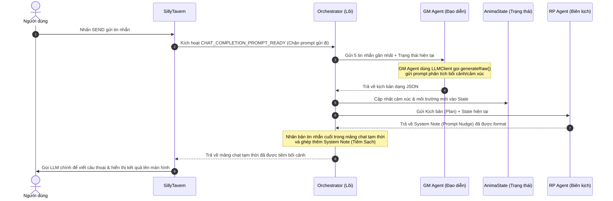
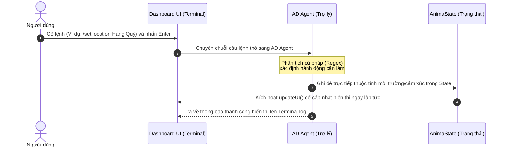

# Cấu trúc dự án & Sơ đồ hoạt động (Anima Engine v0.13.0)

Tài liệu này tổng hợp cấu trúc mã nguồn hiện tại của extension Anima và mô tả chi tiết luồng vận hành của hệ thống khi tương tác với người dùng và mô hình ngôn ngữ (LLM).

---

## 📁 1. Cấu trúc thư mục dự án

```
ST Anima/
├── AGENTS.md               # Nhật ký trạng thái dự án & Shared Knowledge
├── README.md               # Hướng dẫn chung cho lập trình viên
├── package.json            # Cấu hình dự án (Vitest, ESLint, Prettier)
├── manifest.json           # Metadata của ST extension (v0.13.0)
├── panel.html              # Giao diện Dashboard UI của Anima trên SillyTavern
├── style.css               # Tệp CSS định hình kiểu dáng Dashboard
├── index.js                # Điểm khởi đầu (Entry point), nạp thư viện jQuery và khởi tạo các thành phần
│
├── src/                    # Mã nguồn chính của extension
│   ├── agents/             # Thư mục chứa các Agent (GM, RP, AD)
│   │   ├── gm.js           # GM Agent: Lên kế hoạch kể chuyện (LLM-powered)
│   │   ├── rp.js           # RP Agent: Định dạng chỉ thị ẩn (System Note / Nudge)
│   │   ├── ad.js           # AD Agent: Nhận và xử lý lệnh Console (Backstage)
│   │   └── __tests__/      # Unit tests dành riêng cho các Agent
│   │
│   ├── core/               # Thư mục lõi quản lý luồng dữ liệu & trạng thái
│   │   ├── state.js        # State Manager: Lưu trữ cảm xúc, kế hoạch và môi trường (Environment)
│   │   ├── orchestrator.js # Event Orchestrator: Lắng nghe sự kiện ST, điều phối các Agent
│   │   └── __tests__/      # Unit tests cho trạng thái lõi
│   │
│   ├── ui/                 # Giao diện người dùng
│   │   └── dashboard.js    # UI Manager: Cập nhật DOM, quản lý model selector và terminal console
│   │
│   └── utils/              # Các công cụ hỗ trợ
│       ├── logger.js       # Hệ thống ghi log (logAnima) và xuất log
│       ├── constants.js    # Các hằng số cấu hình của hệ thống
│       └── llm.js          # Wrapper gọi API generateRaw của SillyTavern
│
├── archive/                # Thư mục lưu trữ các phiên bản cũ và file nháp (không xóa)
└── docs/                   # Tài liệu specs và hướng dẫn
    ├── specs/              # Tài liệu đặc tả kỹ thuật của từng phiên bản
    ├── history/            # Lịch sử thay đổi
    ├── TEST_GUIDE_v0.13.0.md # Hướng dẫn test bản v0.13.0
    └── CHANGELOG_v0.13.0.md  # Chi tiết cập nhật bản v0.13.0
```

---

## ⚙️ 2. Sơ đồ hoạt động (Luồng xử lý sự kiện)

### A. Luồng gửi tin nhắn (Khi người dùng nhấn SEND)

Khi người dùng nhập tin nhắn và nhấn **Gửi** trên giao diện chat SillyTavern, luồng xử lý diễn ra như sau:



---

### B. Luồng xử lý lệnh Console (Khi người dùng gõ lệnh Backstage Terminal)

Khi người dùng muốn can thiệp thủ công vào bối cảnh hoặc cảm xúc nhân vật ở hậu trường:



---

## 🛠️ 3. Chi tiết hoạt động của các thành phần

| Thành phần | Đầu vào | Quy trình xử lý | Đầu ra |
|---|---|---|---|
| **GM Agent** *(Bộ não)* | Lịch sử chat (5 tin nhắn gần nhất), Trạng thái cảm xúc, Môi trường hiện tại. | 1. Tạo prompt yêu cầu LLM phân tích tình huống.<br/>2. Gọi API `generateRaw()` của SillyTavern.<br/>3. Phân tích kết quả trả về dạng JSON từ LLM. | Kế hoạch hội thoại (`plan`) và cập nhật chỉ số (`state_update`). |
| **RP Agent** *(Giao diện)* | Kế hoạch từ GM Agent, Trạng thái môi trường và cảm xúc hiện tại. | 1. Ghép các thông số môi trường (vị trí, thời tiết, thời gian) và kịch bản vào template định sẵn.<br/>2. Tạo ra chuỗi System Note chỉ thị cho LLM chính của nhân vật. | Chuỗi System Note dạng text (Narrative Nudge). |
| **AD Agent** *(Điều phối)* | Câu lệnh thô từ bảng điều khiển console (Terminal). | 1. Khớp chuỗi lệnh bằng Regex (nhận diện các từ khóa `set`, `status`, `reset`).<br/>2. Gọi trực tiếp các phương thức ghi đè của State. | Trạng thái thành công/thất bại và thông báo phản hồi cho người dùng. |
